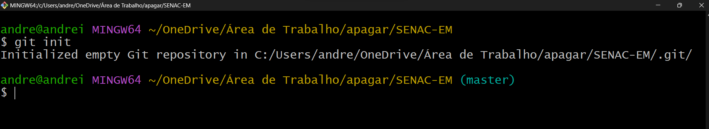
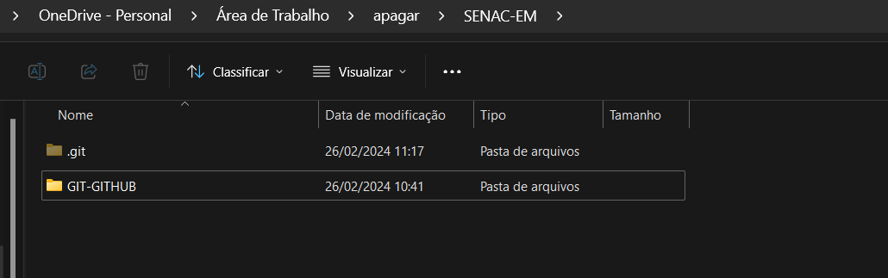
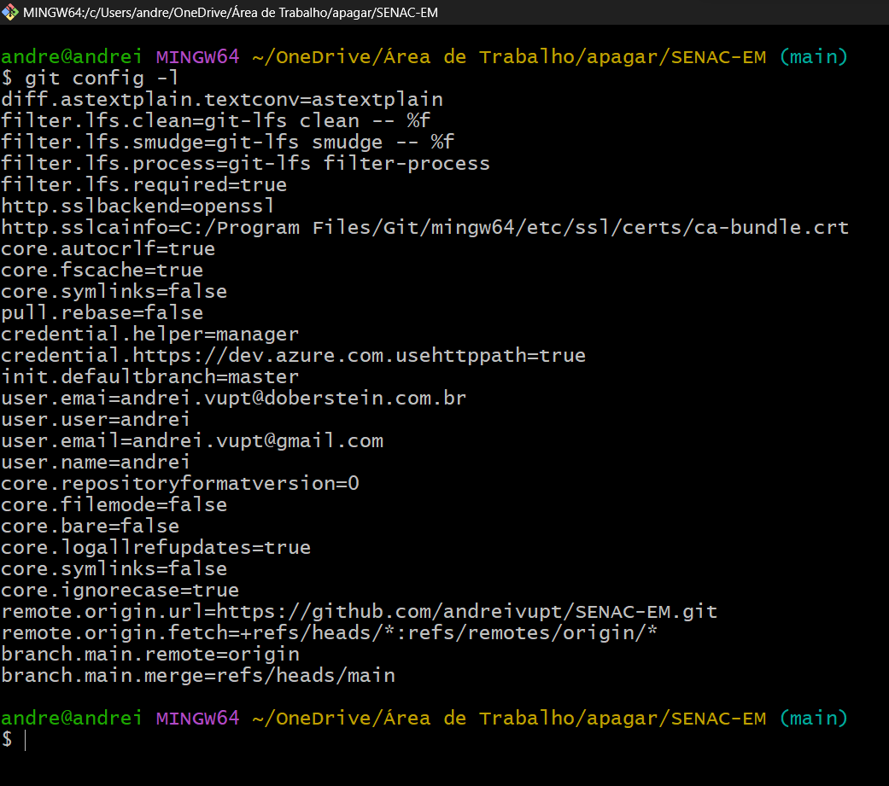
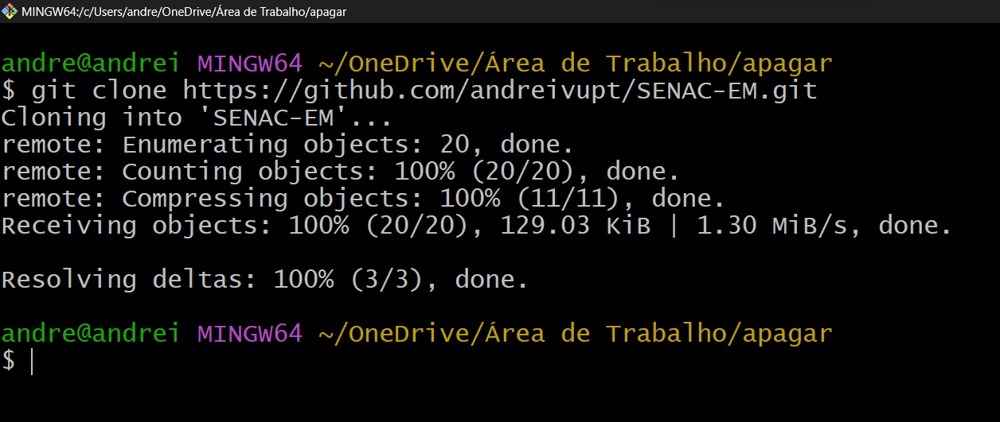
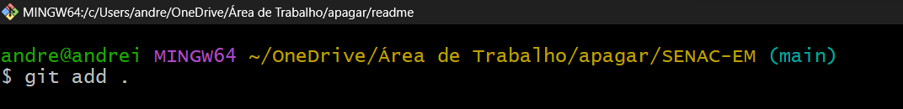
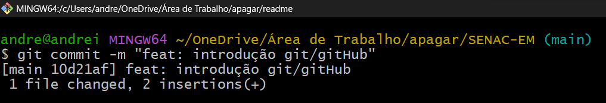

# Gerenciamento de código com git e gitHub

## O que é git ?

* Git, basicamente são comandos utilizados pelo terminal, onde gerenciamos o histórico de mudanças usando um sistema de controle de versão desenvolvido por Linus Torvalds (o criador do Linux). Isso significa que qualquer desenvolvedor numa equipe pode gerenciar o repositório local (código que está no nosso computador) e o repositório remoto (pasta do nosso projeto que está no gitHub)

Exemplos:
* git add .
* git status
* git push origin main

## O que é terminal ?

* É uma famosa tela preta, conhecida pelos programadores, na qual você digita comandos para dar instruções para um computador e visualizar informações dessa máquina. Ou seja, ele serve para você executar tarefas no computador sem utilizar a interface gráfica, com pastinhas e ícones, ou o bom e velho mouse

Exemplos:
* CMD
* PowerShell
* GitBash

## O que é gitHub ?
* GitHub é uma espécie de "rede social para programadores". Sendo um repositório remoto (código que está na nuvem) utilizado com um serviço de publicação e compartilhamento de códigos de programação. Lançada em 2008, a plataforma é usada mundialmente e é, desde 2018, de propriedade da Microsoft

<hr>

## Principais comandos git

### NOME

```
git init
```
### RESUMO

* Este comando cria um repositório Git vazio, basicamente uma pasta oculta ".git", responsável pelo gerenciamento dos repositórios e arquivos contidos na pasta criada no computador onde o comando foi executado


### EXEMPLOS
* Comando sendo executado<p>


* Imagem da pasta oculta ".git" no computador<p>


<hr>

### A primeira coisa que você deve fazer após instalar o Git é configurar seu nome de usuário e endereço de e-mail. Isto é importante porque cada commit usa esta informação, e ela é carimbada de forma imutável nos commits que você começa a criar

### NOME
```
git config -l
```

### EXEMPLO


### DESCRIÇÃO
* O config é um comando inicial para vincular o trabalho no repositório local com sua conta no github. Assim, é configurado com o nome e com o e-mail. Este comando "git config" obtem e define opções globais ou do repositório

### OPÇÕES

```
git config --global user.name "DIGITE_SEU_NOME_AQUI"
```
* Altere o campo 'DIGITE_SEU_NOME_AQUI' e coloque o seu nome

```
 git config --global user.email "DIGITE_SEU_EMAIL_AQUI"
```
* Altere o campo 'DIGITE_SEU_EMAIL_AQUI' e coloque o seu email do gitHub

<hr>

### NOME
```
git clone
```

### DESCRIÇÃO
* O comando é executado junto com a URL do repositório do gitHub em uma pasta criada no computador

### EXEMPLO


<hr>

### NOME
```
git add .
```

### DESCRIÇÃO
* Este comando é utilizado para adicionar novos arquivos ou alterações que realizamos em nosso repositório local

### EXEMPLO


<hr>

### NOME
```
git commit -m "mensagem"
```

### DESCRIÇÃO

* Salva as alterações e leva as mudanças de um ambiente local para o repositório no git, permitindo ainda a inserção de uma mensagem descritiva. Assim, a cada mudança ou finalização de uma tarefa, a pessoa desenvolvedora pode enviar seus feitos e deixar claro para as outras pessoas o que ela fez.

### OPÇÕES

* <b>-m (message):</b> atributo do comando que representa que estamos enviando uma mensagem

* <b>"mensagem":</b> descrever um breve contexto sobre as ações realizadas no código, entre aspas

### EXEMPLO


<hr>

### NOME
```
git push -u origin main
```

### DESCRIÇÃO
* O push serve para subir as alterações locais para um certo repositório remoto. Ele entrega todos os commits e a mensagem

### OPÇÕES

* <b>-u (user):</b> atributo do comando que representa o usuario que configuramos
* <b>origin:</b> nome do repositório remoto
* <b>main:</b> nome da branch


### EXEMPLO


<hr>

### NOME
```
git branch cadastrar-usuario
```

### DESCRIÇÃO
* Para trabalhar em equipe, você pode criar diferentes branches (ramificações), e o git administra todas elas em paralelo para evitar problemas de versão. Então, posteriormente, com um comando que veremos, é possível unificar as ramificações.

### OPÇÕES

* <b>cadastrar-usuario:</b> exemplo para nomear nova ramificação do repositório

<hr>

### NOME
```
git merge main
```

### DESCRIÇÃO
* Depois de programar em uma branch, você tem que fazer uma conjunção dela com outras para de fato subir as alterações. É só colocar o nome da branch que desejamos mesclar com a principal depois do termo merge

### OPÇÕES

* <b>main:</b> nome da branch que desejamos unificar a branch criada

<hr>

### NOME
```
git checkout cadastrar-usuario
```

### DESCRIÇÃO
* O objetivo dele é fazer a pessoa programadora mudar de branch. Você pode usar o “git branch” para saber quais existem e depois trocar de uma para outra. 

### OPÇÕES

* <b>cadastrar-usuario:</b> nome da branch que desejamos acessar

<hr>

### NOME
```
git pull origin main
```

### DESCRIÇÃO
* Antes de começar a programar em algum repositório, é bom também executar um “pull”. Esse comando traz para a sua máquina (repositório local) todas as mudanças que foram realizadas. Ou seja, é uma forma de atualizar a sua versão da aplicação com o que foi alterado remotamente 

### OPÇÕES

* <b>origin:</b> nome do repositório remoto
* <b>main:</b> nome da branch

<hr>


